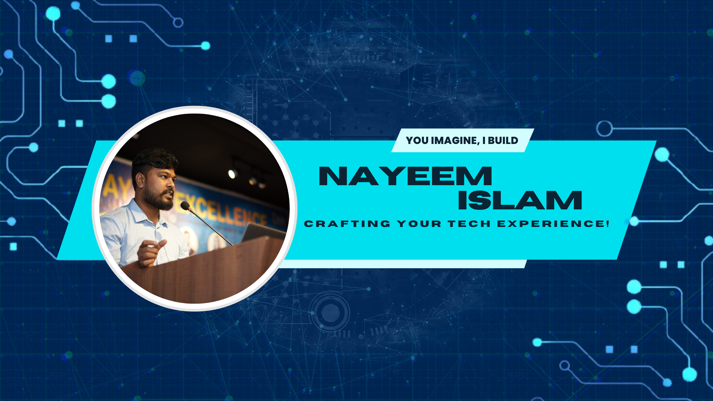

  

  <h1>Hello, I'm Nayeem Islam</h1>

   

  

  
<b>Engineering Manager &amp; GenAI Lead</b> building high-velocity teams and production-grade AI systems.

   

  <table>
    <tr>
      <td>
        
      </td>
      <td>
        
      </td>
    </tr>
    <tr>
      <td>
        
      </td>
      <td>
        
      </td>
    </tr>
  </table>

   

  

   
   

  

---

## 🚀 Executive Summary

> - **Engineering Manager & GenAI Lead** with **5+ years** owning end-to-end SDLC for AI-powered products serving **30M+ users**.
> - **Orchestrates the Generative AI lifecycle** - from opportunity framing, model selection & RAG/agents, to secure, observable production rollout.
> - **Builds high-velocity teams** by aligning architecture, process, and mentorship for **50+ engineers** across platforms and products.
>
> *"Empowering minds with clarity - turning Agentic AI, MCP, data, and ML concepts into reliable production systems."*

---

## 📊 Impact Highlights

- **30M+ users** served across AI-powered and cloud-native products.
- **40% faster delivery cycles** by redesigning SDLC workflows, CI/CD, and release governance.
- **50+ engineers** coached from junior to senior levels through structured mentoring and 1:1s.
- **GenAI initiatives from 0 → 1 → production**, including RAG platforms, agentic workflows, and evaluation pipelines.

---

## 🛠️ Technical & Leadership Arsenal

| Domain | Core Stack |
| :--- | :--- |
| **🤖 GenAI & LLMs** | Python • LangChain • LangGraph • LlamaIndex • Agno • CrewAI • Pydantic AI • Hugging Face • OpenAI |
| **⚙️ Platforms & Engineering** | Python • JavaScript • TypeScript • Go • Rust • React.js • Next.js • Django • FastAPI • Node.js |
| **☁️ Cloud & DevOps** | AWS • GCP • Azure • DigitalOcean • Docker • Kubernetes • Terraform • Ansible |
| **📊 Data & Analytics** | PostgreSQL • MySQL • MongoDB • Redis • Elasticsearch • Pandas • NumPy • scikit-learn |
| **🧭 Leadership & Process** | Engineering management • Agile & Scrum • Roadmapping • Hiring & interviewing • Stakeholder communication |

<b>More tools I use in practice</b>

- Infrastructure & CI/CD: GitHub Actions • GitLab CI/CD • Jenkins • CircleCI • ArgoCD
- AI tooling: Vector stores, RAG frameworks, observability stacks for production AI

---

## 💡 Leadership Philosophy (Manager README)

> [!TIP]
> **"People over Code"** - shipping durable systems by first investing in the humans who build them.
> - **How I lead**: Clear context, honest feedback, and psychological safety so teams can move fast without burning out.
> - **How we work**: Lightweight process, high ownership, and data-informed decisions over ceremony.
> - **How I support growth**: Structured 1:1s, pairing, and tailored growth plans - from junior to staff levels.
> - **How I partner with stakeholders**: Translate AI and platform strategy into roadmaps, trade-offs, and measurable business outcomes.

---

## 🎓 Certifications

<b>89+ Certifications in AI, Cloud & Leadership - click to expand</b>

- **🤖 AI & ML**: GraphRAG Essential Training • Agentic AI Design Patterns • AI Security (AKYLADE) • LLMOps & Model Deployment
- **☁️ Cloud, DevOps & MLOps**: DevOps Professional Certificate • Kubernetes Crash Course • AWS Fundamentals • Infrastructure as Code (IaC)
- **👔 Leadership & Delivery**: Succeeding as First-Time Tech Manager (PMI) • Agile Project Management (Atlassian) • Scrum Fundamentals
- **🔗 Full list**: See all 89+ certifications on [LinkedIn](https://www.linkedin.com/in/islamnayeem/details/certifications/)

---

## 📈 GitHub Stats & Activity

> If cards appear blank or broken, the public stats services are likely rate-limited. They usually recover on their own.

  <a href="https://github.com/NoManNayeem">
    <picture>
      <source media="(prefers-color-scheme: dark)" srcset="https://github-readme-stats.vercel.app/api?username=NoManNayeem&show_icons=true&theme=tokyonight&hide_border=true&bg_color=0D1117&title_color=c9d1d9&icon_color=58a6ff">
      <source media="(prefers-color-scheme: light)" srcset="https://github-readme-stats.vercel.app/api?username=NoManNayeem&show_icons=true&theme=default&hide_border=true&title_color=0969da&icon_color=0969da">
      
    </picture>
    <picture>
      <source media="(prefers-color-scheme: dark)" srcset="https://github-readme-stats.vercel.app/api/top-langs/?username=NoManNayeem&layout=compact&theme=tokyonight&hide_border=true&bg_color=0D1117&title_color=c9d1d9">
      <source media="(prefers-color-scheme: light)" srcset="https://github-readme-stats.vercel.app/api/top-langs/?username=NoManNayeem&layout=compact&theme=default&hide_border=true&title_color=0969da">
      
    </picture>
  </a>

  <picture>
    <source media="(prefers-color-scheme: dark)" srcset="https://github-readme-streak-stats.herokuapp.com/?user=NoManNayeem&theme=tokyonight&hide_border=true&background=0D1117&ring=58a6ff&fire=58a6ff&currStreakNum=58a6ff">
    <source media="(prefers-color-scheme: light)" srcset="https://github-readme-streak-stats.herokuapp.com/?user=NoManNayeem&theme=default&hide_border=true&ring=0969da&fire=0969da&currStreakNum=0969da">
    
  </picture>

  

  

---

## 🏆 Featured Projects

<table>
  <tr>
    <td>
      <b><a href="https://github.com/NoManNayeem/Ravent">Ravent</a></b> 
      🧠 Production-oriented RAG and Agentic AI reference, showcasing retrieval pipelines and evaluation-ready patterns. 
      <code>Python</code> · <code>LangChain</code> · <code>Agno</code> · <code>ChromaDB</code>
    </td>
    <td>
      <b><a href="https://github.com/NoManNayeem/Agentica">Agentica</a></b> 
      🤖 Agentic AI chat platform with auth, profiles, and extensible tools - a template for enterprise-grade agent experiences. 
      <code>LLM</code> · <code>Python</code> · <code>React</code>
    </td>
  </tr>
  <tr>
    <td>
      <b><a href="https://github.com/NoManNayeem/MarkVista">MarkVista</a></b> 
      📝 Professional Markdown preview & export app demonstrating polished UX, theming, and modern frontend patterns. 
      <code>Next.js 16</code> · <code>Tailwind CSS</code>
    </td>
    <td>
      <b><a href="https://github.com/NoManNayeem/Qall">Qall</a></b> 
      📞 Premium dialer with T9 search focused on responsiveness and offline-friendly mobile UX. 
      <code>React Native</code> · <code>Expo</code>
    </td>
  </tr>
</table>

---

## ✒️ Latest from Medium

*   [**FineTuning PHI-3 for RAG**: Why Small Models Are Best for Production](https://medium.com/@nomannayeem) - How to make compact models competitive for real-world RAG systems.
*   [**Complete Guide to System Design**: From Single Server to Scalable Architecture](https://medium.com/@nomannayeem) - A practical walkthrough of scaling decisions from MVP to high-traffic systems.
*   [**Building AI Agents That Actually Remember**: A Developer’s Guide to Memory Management in 2025](https://medium.com/@nomannayeem) - Patterns for long-term memory and context in modern agent architectures.

   
  
   
   
  

---

  <picture>
    <source media="(prefers-color-scheme: dark)" srcset="https://capsule-render.vercel.app/api?type=waving&color=0d1117&height=100&section=footer">
    <source media="(prefers-color-scheme: light)" srcset="https://capsule-render.vercel.app/api?type=waving&color=ffffff&height=100&section=footer">
    
  </picture>

