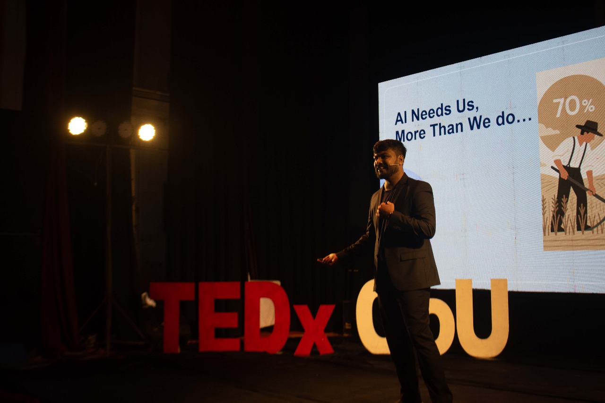
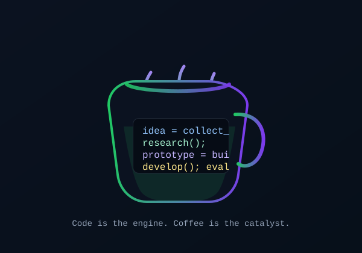

  

  <h1>Hi, I'm Nayeem Islam</h1>

   

  

  
<b>Fractional CTO &amp; Engineering Lead</b> building AI/ML, agentic workflows, and quant-grade systems that ship.

   

  

    
    &nbsp;&nbsp;
    
    &nbsp;&nbsp;
    
    &nbsp;&nbsp;
    
    &nbsp;&nbsp;
    
  

   

  

    

  

  

##  Who I Am

> - **Fractional CTO & Engineering Lead** with **6+ years** turning AI strategy into production systems and durable engineering practices.
> - **AI/ML & Agentic AI**: RAG, LLM pipelines, and multi-step agent workflows across fintech, telecom, logistics, and enterprise SaaS.
> - **Full-Stack / Multi-Stack** engineering across Python, Go, Rust, and TypeScript - end to end, from architecture to CI/CD and rollout.
> - **Quant Developer (HFT)**: low-latency execution + market-data systems that turn signals into reliable trading operations.
>
> *"I build the bridge between models and markets: agentic AI that ships, and performance that holds under real constraints."*

---

  

##  How I Show Up on GitHub

  <a href="https://github.com/NoManNayeem">
    <picture>
      <source media="(prefers-color-scheme: dark)" srcset="https://github-readme-stats.vercel.app/api?username=NoManNayeem&show_icons=true&theme=tokyonight&hide_border=true&bg_color=0D1117&title_color=c9d1d9&icon_color=58a6ff">
      <source media="(prefers-color-scheme: light)" srcset="https://github-readme-stats.vercel.app/api?username=NoManNayeem&show_icons=true&theme=default&hide_border=true&title_color=0969da&icon_color=0969da">
      
    </picture>
    <picture>
      <source media="(prefers-color-scheme: dark)" srcset="https://github-readme-stats.vercel.app/api/top-langs/?username=NoManNayeem&layout=compact&theme=tokyonight&hide_border=true&bg_color=0D1117&title_color=c9d1d9">
      <source media="(prefers-color-scheme: light)" srcset="https://github-readme-stats.vercel.app/api/top-langs/?username=NoManNayeem&layout=compact&theme=default&hide_border=true&title_color=0969da">
      
    </picture>
  </a>

  <picture>
    <source media="(prefers-color-scheme: dark)" srcset="https://github-readme-streak-stats.herokuapp.com/?user=NoManNayeem&theme=tokyonight&hide_border=true&background=0D1117&ring=58a6ff&fire=58a6ff&currStreakNum=58a6ff">
    <source media="(prefers-color-scheme: light)" srcset="https://github-readme-streak-stats.herokuapp.com/?user=NoManNayeem&theme=default&hide_border=true&ring=0969da&fire=0969da&currStreakNum=0969da">
    
  </picture>

  

  

---

  

##  What I Deliver

- **Production AI/ML systems**: scalable RAG, LLM pipelines, and agentic workflows used across multiple countries.
- **Reliable automation**: turning ambiguous workflows into governed, observable systems with evaluation-ready patterns.
- **Team acceleration**: mentorship, engineering standards, and high-velocity delivery across platforms.
- **40+ workshops delivered** to grow developer capability and ecosystem adoption.
- **Production quant engineering**: low-latency pipelines, execution logic, and monitoring for trading workflows.
- **Research-to-production loop**: collaborating with research to validate signals and ship robust execution in production.

---

  

##  Idea → Research → Development Loop

  

- Idea: capture the signal, constraints, and success criteria
- Research: validate hypotheses, data readiness, and evaluation strategy
- Data & Prototype: build the experiment harness and iterate quickly
- Development: productionize end-to-end AI/agent workflows and automation
- Evaluate: run robust offline + online checks with monitoring and governance
- Deploy: ship with CI/CD, rollout control, and reliability focus
- Feedback: measure outcomes and refine models, prompts, and policies
- Scale: expand across teams, products, and multi-country operations

---

  

##  What I'm Building Now

> **Currently:** Manager II -- Lead, Applied ML Engineer at **NEXT Ventures** (Feb 2026 -- Present)
>
> - **Focus:** Production LLMs, scalable RAG, agentic AI workflows, and quantitative system design.
> - **Open for:** Fractional CTO engagements, end-to-end AI architecture, agent automation, and performance-focused engineering.

---

  

##  How I Build

<table>
  <tr>
    <td><b>AI/ML & Agentic</b></td>
    <td>
      
      
      
      
      
      
    </td>
  </tr>
  <tr>
    <td><b>AI Frameworks</b></td>
    <td>
      
      
      
      
      
      
      
    </td>
  </tr>
  <tr>
    <td><b>Full-Stack</b></td>
    <td>
      
      
      
      
      
      
    </td>
  </tr>
  <tr>
    <td><b>Languages</b></td>
    <td>
      
      
      
      
      
      
      
    </td>
  </tr>
  <tr>
    <td><b>Quant / HFT</b></td>
    <td>
      
      
      
      
    </td>
  </tr>
  <tr>
    <td><b>Cloud / DevOps</b></td>
    <td>
      
      
      
      
      
    </td>
  </tr>
  <tr>
    <td><b>Databases</b></td>
    <td>
      
      
      
      
      
      
    </td>
  </tr>
</table>

<b>More tools I use in practice</b>

- Infrastructure & CI/CD: GitHub Actions, GitLab CI/CD, Jenkins, CircleCI, ArgoCD
- AI tooling: Vector stores, RAG frameworks, observability stacks for production AI

---

  

##  Code & Coffee

  

Code powers the system; coffee keeps the cadence. Build, evaluate, deploy, and iterate until it ships cleanly.

---

  

##  What I've Shipped

<table>
  <tr>
    <td>
      <b>AmICredible.ai</b> 
      AI-Powered Credibility Assessment (DataCrunch, 2025) 
      <code>LLMs</code> <code>Agentic AI</code> <code>Explainability</code>
    </td>
    <td>
      <b>AgentiCredit.ai</b> 
      Agentic AI Credit Evaluation (DataCrunch, 2025) 
      <code>Multi-step Reasoning</code> <code>Compliance</code> <code>Explainability</code>
    </td>
  </tr>
  <tr>
    <td>
      <b>XPress Fuel</b> 
      AI-Powered Fuel Delivery (Impala Intech, 2024) 
      <code>AI Route Optimization</code> <code>SAP Integration</code> <code>Mobile Fleet Mgmt</code>
    </td>
    <td>
      <b>Digimart</b> 
      Telco Developer Ecosystem (hSenid / Grameenphone, 2023--2024) 
      <code>Telco-Enabled Apps</code> <code>Workshops</code> <code>Ecosystem Growth</code>
    </td>
  </tr>
</table>

---

  

##  Talks & Speaking

  
   
  Watch my TEDx talk on engineering, AI, and impact.

- TEDxCOU Speaker: delivered "Empowered for Tomorrow: Your Transition to an AI-Ready Future" on AI transformation and workforce readiness.
- Developer Community Builder: designed and led 40+ technical workshops through the Digimart ecosystem, nurturing talent and enabling startups.
- Technical Writer: ongoing Medium posts on AI/ML, agentic systems, and software engineering (@nomannayeem).

---

  

##  Career Highlights

- **NEXT Ventures** -- Manager II - Lead, Applied ML Engineer (Feb 2026 -- Present): leading production AI/ML + R&D and agentic workflow execution.
- **DataCrunch** -- Technical Lead (Jan 2025 -- Jan 2026): architected end-to-end AI pipelines for autonomous reasoning and real-time decision-making.
- **JB Connect Ltd.** -- Lead Software Engineer (Nov 2024 -- Jan 2026): owned full-cycle engineering delivery for enterprise telecom/fintech/e-commerce clients.
- **Impala Intech Ltd.** -- Project Lead (Oct 2024 -- Jan 2025): directed XPress Fuel launch with mobile, SAP integration, and AI-driven route optimization.
- **Blockstak** -- Tech Consultant (Aug 2023 -- Dec 2024): built LLM/RAG solutions and provided architectural guidance on inference and product strategy.
- **hSenid / Grameenphone** -- Project Lead (Aug 2023 -- Oct 2024): expanded the Digimart developer ecosystem and delivered 40+ workshops.
- **ADA** -- Telco Data & Product Development Specialist (Aug 2021 -- Aug 2023): built SMS automation with analytics-led campaign optimization.

---

  

##  How I Lead

> [!TIP]
> **"People over Code"** - shipping durable systems by first investing in the humans who build them.
> - **How I lead**: Clear context, honest feedback, and psychological safety so teams can move fast without burning out.
> - **How we work**: Lightweight process, high ownership, and data-informed decisions over ceremony.
> - **How I support growth**: Structured 1:1s, pairing, and tailored growth plans - from junior to staff levels.
> - **How I partner with stakeholders**: Translate AI and platform strategy into roadmaps, trade-offs, and measurable business outcomes.
> - **How I build community**: Designed and led 40+ workshops to grow developer capability and ecosystem adoption.
> - **Background**: Microsoft YoungBangla Intern (2018) | JPMorgan Chase SWE Virtual Experience (2020).

---

  

##  Proof & Certifications

<b>89+ Certifications in AI, Cloud & Leadership - click to expand</b>

-  **AI & ML**: Scaling AI Models with Mixture of Experts (MOE) -- Design Principles and Real-World Applications
-  **Cloud, DevOps & MLOps**: DevOps Foundations | Digital Manufacturing and Design Technology Specialization
-  **Leadership & Delivery**: Succeeding as First-Time Tech Manager (PMI), Agile Project Management (Atlassian), Scrum Fundamentals
-  **Full list**: See all 89+ certifications on [LinkedIn](https://www.linkedin.com/in/islamnayeem/details/certifications/)

---

  

##  What I Write About

*   [**FineTuning PHI-3 for RAG**: Why Small Models Are Best for Production](https://medium.com/@nomannayeem) - How to make compact models competitive for real-world RAG systems.
*   [**Complete Guide to System Design**: From Single Server to Scalable Architecture](https://medium.com/@nomannayeem) - A practical walkthrough of scaling decisions from MVP to high-traffic systems.
*   [**Building AI Agents That Actually Remember**: A Developer's Guide to Memory Management in 2025](https://medium.com/@nomannayeem) - Patterns for long-term memory and context in modern agent architectures.

   
  
   

---

  <picture>
    <source media="(prefers-color-scheme: dark)" srcset="https://capsule-render.vercel.app/api?type=waving&color=0d1117&height=100&section=footer">
    <source media="(prefers-color-scheme: light)" srcset="https://capsule-render.vercel.app/api?type=waving&color=ffffff&height=100&section=footer">
    
  </picture>

